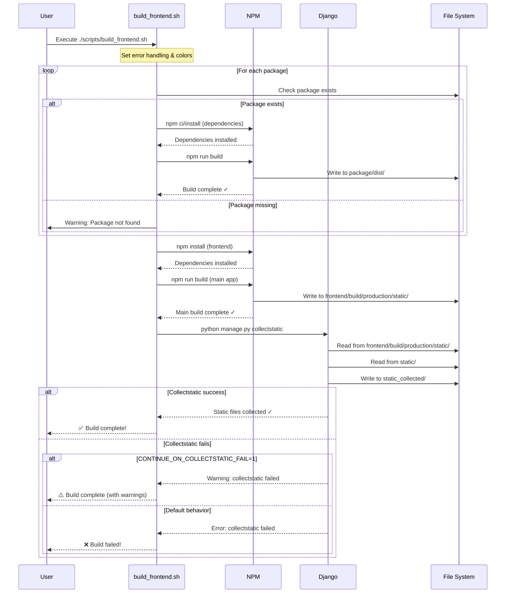

# Frontend Development Workflow

This document describes the frontend build and deployment process for CinemataCMS.

## Overview

The frontend consists of:

- Main frontend application (`/frontend`)
- VJS Plugin packages (`/frontend/packages/`)
  - `vjs-plugin`
  - `vjs-plugin-font-icons`
  - `media-player`

## Prerequisites

### Node.js Installation

CinemataCMS requires Node.js v20 LTS for building frontend assets. The installation is handled automatically by:

- **New installations**: `install.sh` automatically installs Node.js via `install-nodejs.sh`
- **Manual installation**: Run `./install-nodejs.sh` as root
- **Verification**: Run `node -v` and `npm -v` to confirm installation

## Quick Start for Developers

### 1. After Making Frontend Changes

```bash
# Option 1: Use the build script (Recommended)
./scripts/build_frontend.sh

# Option 2: Use Makefile
make frontend-build

# Option 3: Quick build (main app only, skips packages)
make quick-build
```

### 2. Development Workflow

```bash
# Start frontend dev server (hot reload)
make frontend-dev

# OR
cd frontend && npm start
```

### 3. Clean Build

```bash
# Remove all build artifacts
make frontend-clean

# Full rebuild
make frontend-clean && make frontend-build
```

## Understanding the Build Process

### Build Script (`scripts/build_frontend.sh`)

The main build script provides a robust, automated build process with error handling:

- **Features**:
  - Strict error handling with `set -Eeuo pipefail`
  - Color-coded output for better readability
  - Automatic dependency installation (`npm ci` or `npm install`)
  - Sequential package builds with proper error propagation
  - Integrated Django `collectstatic` command

- **Build Order**:
  1. `vjs-plugin-font-icons` package
  2. `vjs-plugin` package
  3. `media-player` package
  4. Main frontend application
  5. Django static file collection

### Build Process Sequence Diagram



### Build Flow

1. **Build Frontend Packages** (in order):
   - `vjs-plugin-font-icons`
   - `vjs-plugin`
   - `media-player`

2. **Build Main Frontend Application**:
   - Runs `npm run build` in `/frontend`
   - Outputs to `/frontend/build/production/static/`

3. **Collect Static Files**:
   - Django's `collectstatic` command
   - Collects from:
     - `/frontend/build/production/static/` (frontend build)
     - `/static/` (existing static assets)
   - Outputs to: `/static_collected/`

### Directory Structure

```
cinematacms/
├── frontend/                      # Frontend source
│   ├── src/                      # Main app source
│   ├── build/                    # Build output
│   │   └── production/
│   │       └── static/          # Built assets
│   │               ├── css/     # Webpack-built CSS files
│   │               ├── js/      # Webpack-built JS files
│   │               └── ...      # Other built assets
│   └── packages/                # Frontend packages
│       ├── vjs-plugin/
│       ├── vjs-plugin-font-icons/
│       └── media-player/
├── static/                       # Django & third-party static files (DO NOT DELETE)
│   ├── admin/                   # Django admin static files
│   ├── lib/                     # Libraries (video.js, fonts, etc.)
│   ├── ckeditor/                # CKEditor assets
│   └── ...                      # Other Django app static files
├── static_collected/             # Final collected static files (git-ignored)
│   ├── css/                     # Frontend CSS from build
│   ├── js/                      # Frontend JS from build
│   ├── admin/                   # Django admin files
│   ├── lib/                     # Libraries
│   └── ...                      # All collected static assets
└── scripts/
    └── build_frontend.sh         # Build automation script
```

**Important**: The `static/` folder contains Django admin files, third-party libraries, and other non-frontend assets. Do NOT delete it - it's required for the application to function properly.

## Makefile Commands

| Command | Description |
|---------|-------------|
| `make frontend-build` | Build all frontend packages and collect static |
| `make frontend-dev` | Start frontend development server |
| `make frontend-clean` | Clean all build directories |
| `make build-all` | Alias for frontend-build |
| `make quick-build` | Build main app only (skips packages) |

## Build Script Usage

The `build_frontend.sh` script provides automated frontend building:

```bash
# Full build (default)
./scripts/build_frontend.sh

# Continue despite collectstatic failures (for CI/CD)
CONTINUE_ON_COLLECTSTATIC_FAIL=1 ./scripts/build_frontend.sh
```

### Error Handling

The script includes robust error handling:
- Exits immediately on any command failure
- Provides colored output for success/warning/error messages
- Shows exact error location (file and line number)
- Optional continue-on-failure mode for `collectstatic`

## Configuration

### Django Settings

The following settings in `cms/settings.py` and `cms/local_settings.py` control static file handling:

```python
# Static files URL prefix
STATIC_URL = "/static/"

# Where collectstatic outputs files
STATIC_ROOT = os.path.join(BASE_DIR, "static_collected")

# Where Django looks for static files
STATICFILES_DIRS = [
    # Frontend build output has priority (includes css/, js/, images/, etc.)
    os.path.join(BASE_DIR, "frontend", "build", "production", "static"),
    # Additional static files directory (admin, lib, etc.)
    os.path.join(BASE_DIR, "static"),
]
```

**Note**: If you have a `cms/local_settings.py` file, make sure it includes the same `STATICFILES_DIRS` configuration, as it overrides the main settings.

### NGINX Configuration

The NGINX configuration in `deploy/mediacms.io` has been updated to serve static files from the correct location:

```nginx
location /static/ {
    alias /home/cinemata/cinematacms/static_collected/;
}
```

This ensures that NGINX serves the collected static files (which include both frontend build output and Django static files) from the `static_collected/` directory.

## System Integration

### Installation Script (`install.sh`)

During initial system setup, `install.sh`:

1. **Installs Node.js automatically**:
   - Detects if `install-nodejs.sh` exists
   - Falls back to creating it inline if missing
   - Installs nvm and Node.js v20 LTS for root user
   - Ensures Node/npm are on PATH for build process

2. **Builds frontend during installation**:
   - Runs `./scripts/build_frontend.sh` after Node.js setup
   - Exits installation if frontend build fails
   - Falls back to `collectstatic` only if Node.js unavailable

### Restart Script (`restart_script.sh`)

The restart script for production deployments:

1. **Pulls latest code**: `git pull`
2. **Updates dependencies**: `pip install -r requirements.txt`
3. **Rebuilds frontend**: `./scripts/build_frontend.sh`
4. **Applies migrations**: Database updates
5. **Restarts services**: All CinemataCMS services

### Node.js Installation (`install-nodejs.sh`)

Standalone Node.js installer with:

- **Safety features**:
  - Strict error handling
  - SHA256 verification support (optional)
  - Installation verification

- **Installation process**:
  - Downloads and installs nvm v0.40.3
  - Installs Node.js v20 LTS
  - Sets as default version
  - Verifies successful installation

## CI/CD Integration

For automated deployments:

```bash
# Ensure Node.js is installed
./install-nodejs.sh

# Build frontend
./scripts/build_frontend.sh

# Or use Makefile
make frontend-build
```

## Troubleshooting

### Problem: Changes not appearing

1. Clear browser cache
2. Run `make frontend-clean && make frontend-build`
3. Check that `STATICFILES_DIRS` includes frontend build directory in both `settings.py` and `local_settings.py`

### Problem: Build fails

1. Check Node.js installation:
   ```bash
   node --version  # Should be v20.x.x
   npm --version   # Should be 10.x.x or higher
   ```
2. If Node.js not found, run: `./install-nodejs.sh` as root
3. Clear npm cache: `npm cache clean --force`
4. Remove node_modules and reinstall:
   ```bash
   cd frontend
   rm -rf node_modules package-lock.json
   npm install
   ```

### Problem: collectstatic reports 0 files

1. Check frontend build succeeded
2. Verify `frontend/build/production/static/` contains files
3. Check `STATICFILES_DIRS` configuration in both `settings.py` and `local_settings.py`
4. Ensure `static/` folder exists and contains Django admin/library files

### Problem: 404 errors for static files

1. Run `python manage.py collectstatic --noinput`
2. Check `STATIC_URL` and `STATIC_ROOT` configuration
3. Ensure web server is configured to serve from `STATIC_ROOT`

## Development Tips

1. **Use frontend dev server for rapid development**:
   - Changes are instantly reflected
   - No need to rebuild for every change

2. **Build only what changed**:
   - Use `--skip-packages` if only main app changed
   - Use `make quick-build` for quick iterations

3. **Automate with git hooks** (optional):
   ```bash
   # .git/hooks/pre-commit
   #!/bin/bash
   make frontend-build
   ```

## Important Notes

### About the static/ folder
- **DO NOT DELETE the `static/` folder** - it contains essential Django admin files, third-party libraries, and other non-frontend assets
- Frontend build files go to `frontend/build/production/static/`
- Both directories are needed and serve different purposes

## Production Deployment

### Manual Deployment

For production:

1. Build frontend: `./scripts/build_frontend.sh`
2. Static files are collected in `static_collected/`
3. Configure web server (nginx/apache) to serve from `STATIC_ROOT`
4. Use CDN for better performance (optional)

### Automated Deployment

Use the restart script for updates:

```bash
# As root user
./restart_script.sh
```

This will:

- Pull latest changes
- Update dependencies
- Rebuild frontend automatically
- Apply migrations
- Restart all services

### Files Collection Summary

After running `make frontend-build` or `python manage.py collectstatic`:

- Frontend CSS/JS from `frontend/build/production/static/` → `static_collected/css/` and `static_collected/js/`
- Django admin files from `static/admin/` → `static_collected/admin/`
- Libraries from `static/lib/` → `static_collected/lib/`
- All other static assets → `static_collected/`

## Need Help?

- Check build logs in terminal output
- Review Django's collectstatic output
- Ensure all npm dependencies are installed
- Check file permissions on directories
- Verify both `settings.py` and `local_settings.py` have correct `STATICFILES_DIRS`
